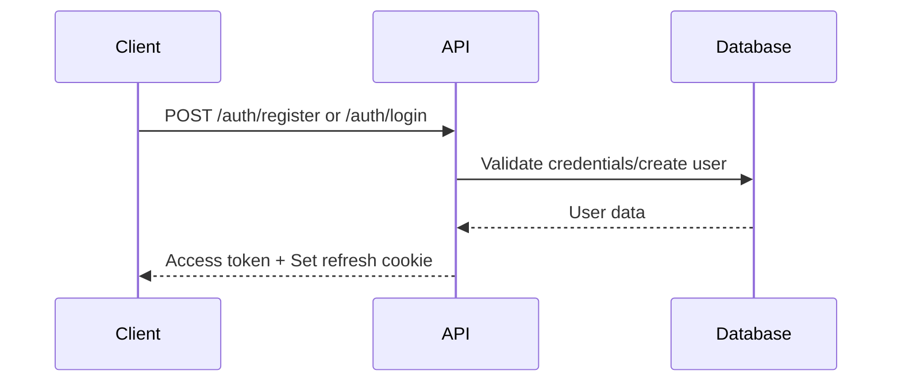
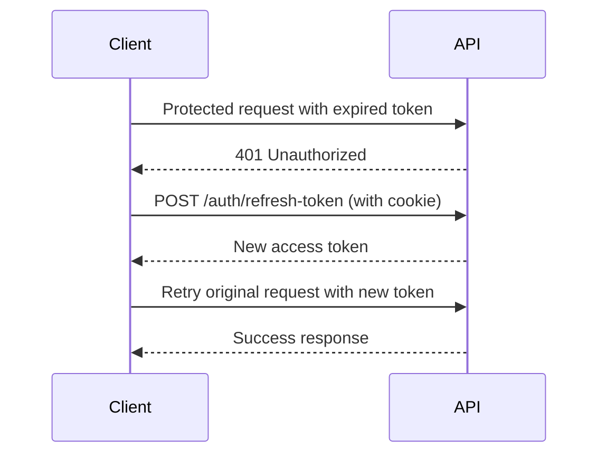

# Authentication

The Blog API uses JSON Web Tokens (JWT) for authentication, implementing a dual-token strategy with access tokens and refresh tokens for enhanced security.

## Overview

- **Access Token**: Short-lived JWT used for API requests (sent in Authorization header)
- **Refresh Token**: Long-lived JWT stored in HTTP-only cookie for token renewal
- **Security**: Role-based access control with 'admin' and 'user' roles

## Endpoints

### Register User

Creates a new user account with optional role specification.

**Endpoint**: `POST /auth/register`

**Authentication**: None required

**Request Body**:

```json
{
  "email": "user@example.com",
  "password": "securepassword123",
  "role": "user" // Optional: "user" or "admin"
}
```

**Success Response** (201 Created):

```json
{
  "accessToken": "eyJhbGciOiJIUzI1NiIsInR5cCI6IkpXVCJ9...",
  "user": {
    "_id": "60b7c8b4f9b3c12345678901",
    "email": "user@example.com",
    "username": "user123",
    "role": "user",
    "firstName": null,
    "lastName": null,
    "socialLinks": {},
    "createdAt": "2024-01-15T10:30:00.000Z",
    "updatedAt": "2024-01-15T10:30:00.000Z"
  }
}
```

**Error Responses**:

- `400` - Validation errors (invalid email, password too short)
- `403` - Admin registration denied for non-whitelisted email
- `500` - Internal server error

**Notes**:

- Password must be at least 8 characters
- Admin registration requires email to be on server whitelist
- Sets `refreshToken` HTTP-only cookie automatically

---

### Login User

Authenticates existing user and returns access token.

**Endpoint**: `POST /auth/login`

**Authentication**: None required

**Request Body**:

```json
{
  "email": "user@example.com",
  "password": "securepassword123"
}
```

**Success Response** (200 OK):

```json
{
  "accessToken": "eyJhbGciOiJIUzI1NiIsInR5cCI6IkpXVCJ9...",
  "user": {
    "_id": "60b7c8b4f9b3c12345678901",
    "email": "user@example.com",
    "username": "user123",
    "role": "user",
    "firstName": "John",
    "lastName": "Doe",
    "socialLinks": {
      "website": "https://johndoe.com",
      "linkedin": "https://linkedin.com/in/johndoe"
    },
    "createdAt": "2024-01-15T10:30:00.000Z",
    "updatedAt": "2024-01-20T15:45:00.000Z"
  }
}
```

**Error Responses**:

- `400` - Invalid credentials or validation errors
- `404` - User not found
- `500` - Internal server error

---

### Refresh Access Token

Generates a new access token using the refresh token cookie.

**Endpoint**: `POST /auth/refresh-token`

**Authentication**: Requires `refreshToken` cookie (sent automatically by browser)

**Request Body**: None

**Success Response** (200 OK):

```json
{
  "accessToken": "eyJhbGciOiJIUzI1NiIsInR5cCI6IkpXVCJ9..."
}
```

**Error Responses**:

- `400` - Missing or invalid refresh token cookie
- `401` - Expired or invalid refresh token
- `500` - Internal server error

**Usage Example**:

```javascript
// When your access token expires (401 error), call refresh endpoint
const response = await fetch("/api/v1/auth/refresh-token", {
  method: "POST",
  credentials: "include", // Important: includes cookies
});

if (response.ok) {
  const { accessToken } = await response.json();
  // Use new access token for subsequent requests
  localStorage.setItem("accessToken", accessToken);
}
```

---

### Logout User

Invalidates refresh token and clears cookie.

**Endpoint**: `POST /auth/logout`

**Authentication**: Requires both access token (header) and refresh token (cookie)

**Headers**:

```http
Authorization: Bearer <access_token>
```

**Request Body**: None

**Success Response** (200 OK):

```json
{
  "message": "Logged out successfully"
}
```

**Error Responses**:

- `400` - Missing refresh token cookie
- `401` - Invalid or expired tokens
- `500` - Internal server error

## Authentication Flow

### 1. Initial Authentication



### 2. Making Authenticated Requests

```javascript
// Include access token in all protected requests
const response = await fetch("/api/v1/users/current", {
  method: "GET",
  headers: {
    Authorization: `Bearer ${accessToken}`,
    "Content-Type": "application/json",
  },
});
```

### 3. Token Refresh Flow



### 4. Logout

```javascript
// Logout and clear tokens
await fetch("/api/v1/auth/logout", {
  method: "POST",
  headers: {
    Authorization: `Bearer ${accessToken}`,
  },
  credentials: "include",
});

// Clear stored access token
localStorage.removeItem("accessToken");
```

## Security Best Practices

1. **Store Access Tokens Securely**: Use secure storage (not localStorage in production)
2. **Handle Token Expiration**: Implement automatic refresh logic
3. **Secure Cookies**: Refresh tokens are stored in HTTP-only, secure cookies
4. **Logout Properly**: Always call logout endpoint to invalidate refresh tokens
5. **HTTPS Only**: Use HTTPS in production for token security

## Role-Based Access

### User Role (`user`)

- Can manage own profile
- Can create, view, and manage own comments
- Can like/unlike blog posts
- Can view published blog posts

### Admin Role (`admin`)

- All user permissions
- Can view all users and manage user accounts
- Can create, edit, and delete blog posts
- Can view draft blog posts
- Can delete any comments

## Common Authentication Errors

| Status Code | Error Code          | Description                   | Solution                    |
| ----------- | ------------------- | ----------------------------- | --------------------------- |
| 400         | ValidationError     | Invalid email/password format | Check request format        |
| 401         | AuthenticationError | Missing/invalid/expired token | Refresh token or re-login   |
| 403         | AuthorizationError  | Insufficient permissions      | Check user role             |
| 403         | AuthorizationError  | Admin registration denied     | Contact admin for whitelist |

## Code Examples

### Complete Authentication Implementation

```javascript
class BlogAPIAuth {
  constructor(baseURL) {
    this.baseURL = baseURL;
    this.accessToken = localStorage.getItem("accessToken");
  }

  async register(email, password, role = "user") {
    const response = await fetch(`${this.baseURL}/auth/register`, {
      method: "POST",
      headers: { "Content-Type": "application/json" },
      credentials: "include",
      body: JSON.stringify({ email, password, role }),
    });

    if (response.ok) {
      const data = await response.json();
      this.accessToken = data.accessToken;
      localStorage.setItem("accessToken", this.accessToken);
      return data;
    }
    throw new Error(await response.text());
  }

  async login(email, password) {
    const response = await fetch(`${this.baseURL}/auth/login`, {
      method: "POST",
      headers: { "Content-Type": "application/json" },
      credentials: "include",
      body: JSON.stringify({ email, password }),
    });

    if (response.ok) {
      const data = await response.json();
      this.accessToken = data.accessToken;
      localStorage.setItem("accessToken", this.accessToken);
      return data;
    }
    throw new Error(await response.text());
  }

  async refreshToken() {
    const response = await fetch(`${this.baseURL}/auth/refresh-token`, {
      method: "POST",
      credentials: "include",
    });

    if (response.ok) {
      const data = await response.json();
      this.accessToken = data.accessToken;
      localStorage.setItem("accessToken", this.accessToken);
      return data.accessToken;
    }
    return null;
  }

  async makeAuthenticatedRequest(url, options = {}) {
    const headers = {
      "Content-Type": "application/json",
      ...options.headers,
    };

    if (this.accessToken) {
      headers.Authorization = `Bearer ${this.accessToken}`;
    }

    let response = await fetch(url, {
      ...options,
      headers,
      credentials: "include",
    });

    // Handle token expiration
    if (response.status === 401) {
      const newToken = await this.refreshToken();
      if (newToken) {
        headers.Authorization = `Bearer ${newToken}`;
        response = await fetch(url, {
          ...options,
          headers,
          credentials: "include",
        });
      }
    }

    return response;
  }

  async logout() {
    if (this.accessToken) {
      await fetch(`${this.baseURL}/auth/logout`, {
        method: "POST",
        headers: { Authorization: `Bearer ${this.accessToken}` },
        credentials: "include",
      });
    }

    this.accessToken = null;
    localStorage.removeItem("accessToken");
  }
}
```
