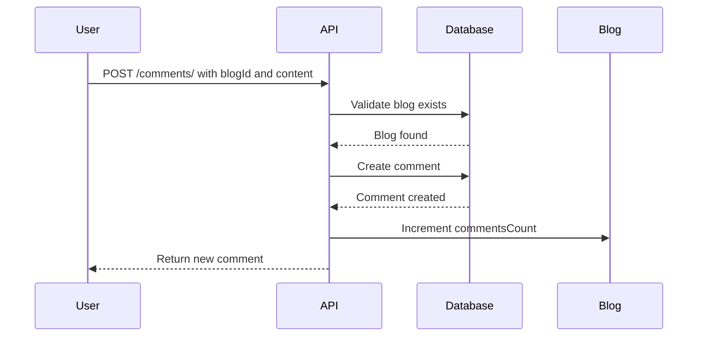
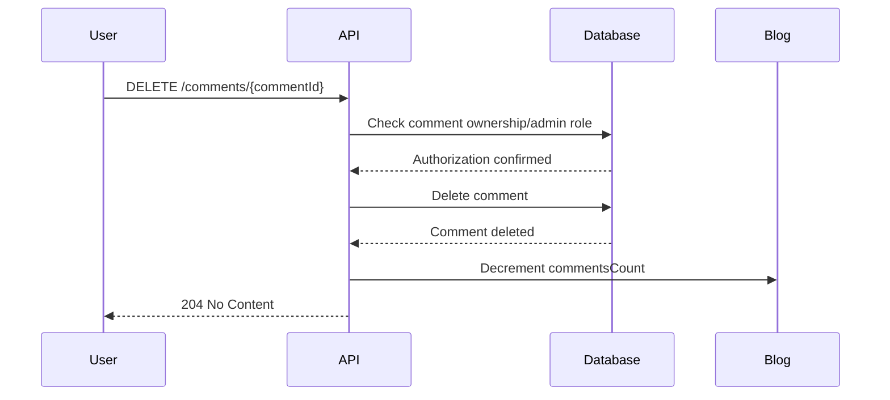

# Comments

The Comments API allows users to add, retrieve, and manage comments on blog posts. All authenticated users can create and view comments, while comment deletion is restricted to the comment author or administrators.

## Endpoints

### Create Comment

Adds a new comment to a specific blog post and increments the blog's comment count.

**Endpoint**: `POST /comments/`

**Authentication**: Required (Bearer token)

**Request Body**:

```json
{
  "blogId": "60b7c8b4f9b3c12345678903",
  "content": "Great article! The examples really helped me understand the concepts better."
}
```

**Success Response** (201 Created):

```json
{
  "comment": {
    "_id": "60b7c8b4f9b3c12345678905",
    "blogId": "60b7c8b4f9b3c12345678903",
    "userId": "60b7c8b4f9b3c12345678901",
    "content": "Great article! The examples really helped me understand the concepts better.",
    "likesCount": 0,
    "createdAt": "2024-01-21T14:30:00.000Z",
    "updatedAt": "2024-01-21T14:30:00.000Z"
  }
}
```

**Error Responses**:

- `400` - Validation errors (missing blogId, content too long, etc.)
- `401` - Unauthorized
- `404` - Blog post not found
- `500` - Internal server error

**Validation Rules**:

- `blogId`: Must be a valid MongoDB ObjectId
- `content`: Required, maximum 1000 characters
- `userId`: Automatically set from authenticated user

---

### Get Comments by Blog

Retrieves all comments associated with a specific blog post, ordered by creation date.

**Endpoint**: `GET /comments/blog/{blogId}`

**Authentication**: Required (Bearer token)

**Path Parameters**:

- `blogId`: MongoDB ObjectId of the blog post

**Success Response** (200 OK):

```json
{
  "comments": [
    {
      "_id": "60b7c8b4f9b3c12345678905",
      "blogId": "60b7c8b4f9b3c12345678903",
      "userId": "60b7c8b4f9b3c12345678901",
      "content": "Great article! The examples really helped me understand the concepts better.",
      "likesCount": 5,
      "createdAt": "2024-01-21T14:30:00.000Z",
      "updatedAt": "2024-01-21T14:30:00.000Z"
    },
    {
      "_id": "60b7c8b4f9b3c12345678906",
      "blogId": "60b7c8b4f9b3c12345678903",
      "userId": "60b7c8b4f9b3c12345678902",
      "content": "I've been looking for a tutorial like this for weeks. Thank you for sharing!",
      "likesCount": 3,
      "createdAt": "2024-01-21T15:45:00.000Z",
      "updatedAt": "2024-01-21T15:45:00.000Z"
    },
    {
      "_id": "60b7c8b4f9b3c12345678907",
      "blogId": "60b7c8b4f9b3c12345678903",
      "userId": "60b7c8b4f9b3c12345678904",
      "content": "Could you elaborate more on the authentication part? I'm still a bit confused about JWT implementation.",
      "likesCount": 1,
      "createdAt": "2024-01-21T16:20:00.000Z",
      "updatedAt": "2024-01-21T16:20:00.000Z"
    }
  ]
}
```

**Error Responses**:

- `401` - Unauthorized
- `404` - Blog post not found
- `500` - Internal server error

**Notes**:

- Comments are returned in chronological order (oldest first)
- No pagination is currently implemented for comments
- Returns empty array if no comments exist

---

### Delete Comment

Deletes a specific comment. Only the comment author or administrators can delete comments. Decrements the blog's comment count.

**Endpoint**: `DELETE /comments/{commentId}`

**Authentication**: Required (Bearer token)

**Path Parameters**:

- `commentId`: MongoDB ObjectId of the comment to delete

**Success Response** (204 No Content): Empty response body

**Error Responses**:

- `401` - Unauthorized
- `403` - Forbidden (user is not the comment author or admin)
- `404` - Comment not found
- `500` - Internal server error

**Authorization Logic**:

- Comment authors can delete their own comments
- Administrators can delete any comment
- Other users receive a 403 Forbidden error

## Comment Lifecycle

### 1. Creation Flow



### 2. Retrieval

- Comments are fetched when viewing a blog post
- All comments for a blog are returned in a single request
- Comments include creation timestamps and like counts

### 3. Deletion Flow



## Code Examples

### Create a Comment

```javascript
const createComment = async (accessToken, blogId, content) => {
  const response = await fetch("/api/v1/comments/", {
    method: "POST",
    headers: {
      Authorization: `Bearer ${accessToken}`,
      "Content-Type": "application/json",
    },
    body: JSON.stringify({
      blogId,
      content,
    }),
  });

  if (response.ok) {
    const data = await response.json();
    return data.comment;
  }

  const error = await response.json();
  throw new Error(error.message || "Failed to create comment");
};
```

### Get Comments for a Blog Post

```javascript
const getBlogComments = async (accessToken, blogId) => {
  const response = await fetch(`/api/v1/comments/blog/${blogId}`, {
    method: "GET",
    headers: {
      Authorization: `Bearer ${accessToken}`,
      "Content-Type": "application/json",
    },
  });

  if (response.ok) {
    const data = await response.json();
    return data.comments;
  }

  throw new Error("Failed to fetch comments");
};
```

### Delete a Comment

```javascript
const deleteComment = async (accessToken, commentId) => {
  const response = await fetch(`/api/v1/comments/${commentId}`, {
    method: "DELETE",
    headers: {
      Authorization: `Bearer ${accessToken}`,
      "Content-Type": "application/json",
    },
  });

  if (response.status === 204) {
    return true;
  }

  if (response.status === 403) {
    throw new Error("You can only delete your own comments");
  }

  throw new Error("Failed to delete comment");
};
```

### Complete Comment Management Class

```javascript
class CommentAPI {
  constructor(baseURL, accessToken) {
    this.baseURL = baseURL;
    this.accessToken = accessToken;
  }

  async createComment(blogId, content) {
    const response = await fetch(`${this.baseURL}/comments/`, {
      method: "POST",
      headers: this._getHeaders(),
      body: JSON.stringify({ blogId, content }),
    });

    return this._handleResponse(response);
  }

  async getBlogComments(blogId) {
    const response = await fetch(`${this.baseURL}/comments/blog/${blogId}`, {
      method: "GET",
      headers: this._getHeaders(),
    });

    const data = await this._handleResponse(response);
    return data.comments;
  }

  async deleteComment(commentId) {
    const response = await fetch(`${this.baseURL}/comments/${commentId}`, {
      method: "DELETE",
      headers: this._getHeaders(),
    });

    if (response.status === 204) {
      return true;
    }

    if (response.status === 403) {
      throw new Error("You can only delete your own comments");
    }

    throw new Error("Failed to delete comment");
  }

  _getHeaders() {
    return {
      Authorization: `Bearer ${this.accessToken}`,
      "Content-Type": "application/json",
    };
  }

  async _handleResponse(response) {
    if (response.ok) {
      return await response.json();
    }

    const error = await response
      .json()
      .catch(() => ({ message: "Unknown error" }));
    throw new Error(error.message || `HTTP ${response.status}`);
  }
}
```

### React Component Example

```jsx
import React, { useState, useEffect } from "react";

const CommentSection = ({ blogId, accessToken }) => {
  const [comments, setComments] = useState([]);
  const [newComment, setNewComment] = useState("");
  const [loading, setLoading] = useState(false);

  useEffect(() => {
    loadComments();
  }, [blogId]);

  const loadComments = async () => {
    try {
      const commentAPI = new CommentAPI("/api/v1", accessToken);
      const fetchedComments = await commentAPI.getBlogComments(blogId);
      setComments(fetchedComments);
    } catch (error) {
      console.error("Failed to load comments:", error);
    }
  };

  const handleSubmitComment = async (e) => {
    e.preventDefault();
    if (!newComment.trim()) return;

    setLoading(true);
    try {
      const commentAPI = new CommentAPI("/api/v1", accessToken);
      const createdComment = await commentAPI.createComment(blogId, newComment);
      setComments([...comments, createdComment]);
      setNewComment("");
    } catch (error) {
      alert("Failed to create comment: " + error.message);
    }
    setLoading(false);
  };

  const handleDeleteComment = async (commentId) => {
    if (!confirm("Are you sure you want to delete this comment?")) return;

    try {
      const commentAPI = new CommentAPI("/api/v1", accessToken);
      await commentAPI.deleteComment(commentId);
      setComments(comments.filter((c) => c._id !== commentId));
    } catch (error) {
      alert("Failed to delete comment: " + error.message);
    }
  };

  return (
    <div className="comment-section">
      <h3>Comments ({comments.length})</h3>

      {/* Comment Form */}
      <form onSubmit={handleSubmitComment} className="comment-form">
        <textarea
          value={newComment}
          onChange={(e) => setNewComment(e.target.value)}
          placeholder="Write a comment..."
          maxLength={1000}
          rows={3}
          required
        />
        <button type="submit" disabled={loading || !newComment.trim()}>
          {loading ? "Posting..." : "Post Comment"}
        </button>
      </form>

      {/* Comments List */}
      <div className="comments-list">
        {comments.map((comment) => (
          <div key={comment._id} className="comment">
            <div className="comment-content">{comment.content}</div>
            <div className="comment-meta">
              <span className="comment-date">
                {new Date(comment.createdAt).toLocaleDateString()}
              </span>
              <span className="comment-likes">{comment.likesCount} likes</span>
              <button
                onClick={() => handleDeleteComment(comment._id)}
                className="delete-button"
              >
                Delete
              </button>
            </div>
          </div>
        ))}
      </div>

      {comments.length === 0 && (
        <p className="no-comments">No comments yet. Be the first to comment!</p>
      )}
    </div>
  );
};
```

## Content Guidelines

### Comment Content

- **Length**: Maximum 1000 characters
- **Format**: Plain text (HTML is not processed)
- **Language**: Should be respectful and constructive
- **Links**: URLs are not automatically converted to clickable links

### Moderation

- Comments are not pre-moderated
- Users can delete their own comments
- Admins can delete any comment
- Consider implementing reporting functionality for inappropriate content

## Best Practices

### For Users

1. **Be Constructive**: Provide helpful, relevant feedback
2. **Stay On Topic**: Keep comments related to the blog post
3. **Be Respectful**: Maintain a professional and courteous tone
4. **Check Length**: Ensure comments are under 1000 characters

### For Developers

1. **Input Validation**: Always validate comment content on both client and server
2. **Rate Limiting**: Consider implementing comment rate limiting to prevent spam
3. **Error Handling**: Provide clear error messages for failed operations
4. **Real-time Updates**: Consider WebSocket integration for real-time comment updates
5. **Pagination**: Implement pagination for blogs with many comments

### Security Considerations

1. **XSS Prevention**: Sanitize comment content before display
2. **Authorization**: Always verify user permissions before allowing operations
3. **Content Filtering**: Consider implementing profanity filters
4. **Spam Detection**: Implement basic spam detection mechanisms

## Future Enhancements

The current comment system can be extended with:

1. **Comment Likes**: Allow users to like/unlike comments
2. **Nested Replies**: Support threaded comment conversations
3. **Edit Comments**: Allow users to edit their comments within a time limit
4. **Comment Notifications**: Notify blog authors of new comments
5. **Rich Text**: Support for basic markdown formatting
6. **Comment Search**: Search functionality within comments
7. **User Mentions**: @ mention functionality for other users
