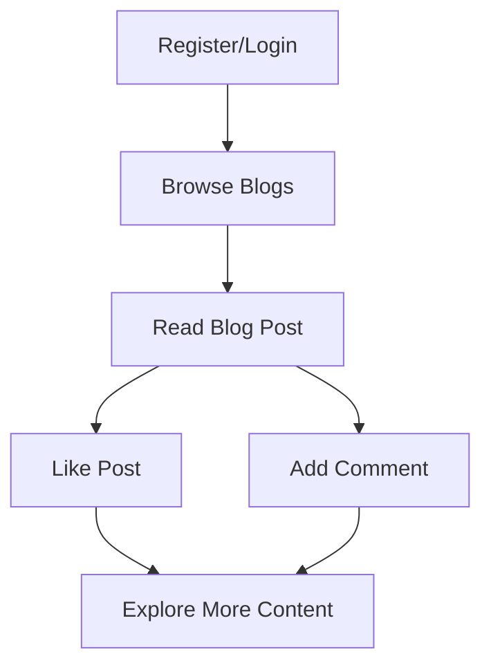
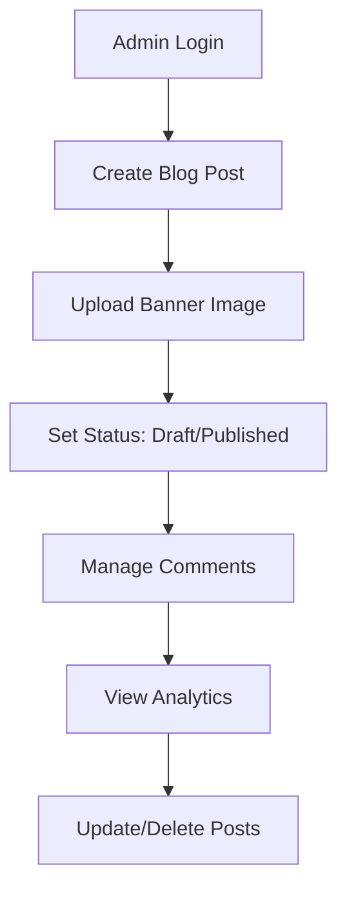
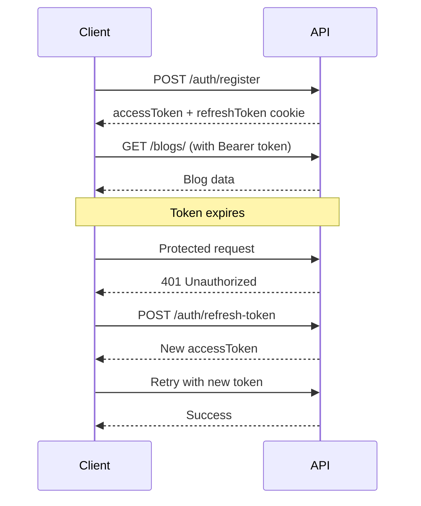

# Quick Start Guide

Get up and running with the Blog API in minutes. This guide will walk you through the essential steps to authenticate, create content, and interact with the API.

## Prerequisites

- Basic understanding of REST APIs and HTTP
- API client (Postman, Insomnia, or code)
- Valid email address for registration

## Base URL

All API requests should be made to:

```
https://blog-api-dc2g.onrender.com/api/v1
```

## Step 1: Check API Status

First, verify the API is running:

**Request:**

```http
GET /
```

**Response:**

```json
{
  "message": "API is live",
  "status": "ok",
  "version": "1.0.0",
  "docs": "https://ashutosh-3.gitbook.io/blog-api/",
  "timestamp": "2024-01-21T10:30:00.000Z"
}
```

✅ If you see this response, the API is ready to use!

## Step 2: Register an Account

Create a new user account to get started:

**Request:**

```http
POST /auth/register
Content-Type: application/json

{
  "email": "your.email@example.com",
  "password": "yourpassword123",
  "role": "user"
}
```

**Response:**

```json
{
  "accessToken": "eyJhbGciOiJIUzI1NiIsInR5cCI6IkpXVCJ9...",
  "user": {
    "_id": "60b7c8b4f9b3c12345678901",
    "email": "your.email@example.com",
    "role": "user",
    "createdAt": "2024-01-21T10:30:00.000Z"
  }
}
```

🔐 **Important**: Save the `accessToken` - you'll need it for authenticated requests!

## Step 3: Get Your Profile

Test authentication by fetching your user profile:

**Request:**

```http
GET /users/current
Authorization: Bearer YOUR_ACCESS_TOKEN
```

**Response:**

```json
{
  "user": {
    "_id": "60b7c8b4f9b3c12345678901",
    "email": "your.email@example.com",
    "role": "user",
    "socialLinks": {},
    "createdAt": "2024-01-21T10:30:00.000Z",
    "updatedAt": "2024-01-21T10:30:00.000Z"
  }
}
```

## Step 4: View Blog Posts

Browse available blog content:

**Request:**

```http
GET /blogs/?limit=5&offset=0
Authorization: Bearer YOUR_ACCESS_TOKEN
```

**Response:**

```json
{
  "limit": 5,
  "offset": 0,
  "total": 12,
  "blogs": [
    {
      "_id": "60b7c8b4f9b3c12345678903",
      "title": "Getting Started with APIs",
      "slug": "getting-started-with-apis",
      "content": "<h1>Introduction</h1><p>APIs are...</p>",
      "author": {
        "username": "admin",
        "role": "admin"
      },
      "likesCount": 15,
      "commentsCount": 3,
      "status": "published"
    }
  ]
}
```

## Step 5: Like a Blog Post

Show appreciation for content:

**Request:**

```http
POST /likes/blog/60b7c8b4f9b3c12345678903
Authorization: Bearer YOUR_ACCESS_TOKEN
```

**Response:**

```json
{
  "likesCount": 16
}
```

## Step 6: Add a Comment

Join the conversation:

**Request:**

```http
POST /comments/
Authorization: Bearer YOUR_ACCESS_TOKEN
Content-Type: application/json

{
  "blogId": "60b7c8b4f9b3c12345678903",
  "content": "Great article! Very helpful for beginners."
}
```

**Response:**

```json
{
  "comment": {
    "_id": "60b7c8b4f9b3c12345678905",
    "blogId": "60b7c8b4f9b3c12345678903",
    "content": "Great article! Very helpful for beginners.",
    "likesCount": 0,
    "createdAt": "2024-01-21T11:00:00.000Z"
  }
}
```

## Step 7: Update Your Profile

Personalize your account:

**Request:**

```http
PUT /users/current
Authorization: Bearer YOUR_ACCESS_TOKEN
Content-Type: application/json

{
  "username": "myawesomeusername",
  "first_name": "John",
  "last_name": "Doe",
  "website": "https://johndoe.com"
}
```

**Response:**

```json
{
  "user": {
    "_id": "60b7c8b4f9b3c12345678901",
    "username": "myawesomeusername",
    "email": "your.email@example.com",
    "firstName": "John",
    "lastName": "Doe",
    "socialLinks": {
      "website": "https://johndoe.com"
    },
    "updatedAt": "2024-01-21T11:15:00.000Z"
  }
}
```

## Quick Code Examples

### JavaScript/Node.js

```javascript
const API_BASE = "https://blog-api-dc2g.onrender.com/api/v1";

class BlogAPI {
  constructor() {
    this.accessToken = null;
  }

  async register(email, password) {
    const response = await fetch(`${API_BASE}/auth/register`, {
      method: "POST",
      headers: { "Content-Type": "application/json" },
      credentials: "include",
      body: JSON.stringify({ email, password, role: "user" }),
    });

    const data = await response.json();
    this.accessToken = data.accessToken;
    return data;
  }

  async getBlogs(limit = 20, offset = 0) {
    const response = await fetch(
      `${API_BASE}/blogs/?limit=${limit}&offset=${offset}`,
      {
        headers: { Authorization: `Bearer ${this.accessToken}` },
      }
    );
    return await response.json();
  }

  async likeBlog(blogId) {
    const response = await fetch(`${API_BASE}/likes/blog/${blogId}`, {
      method: "POST",
      headers: { Authorization: `Bearer ${this.accessToken}` },
    });
    return await response.json();
  }
}

// Usage
const api = new BlogAPI();
await api.register("test@example.com", "password123");
const blogs = await api.getBlogs();
console.log(blogs);
```

### Python

```python
import requests

class BlogAPI:
    def __init__(self):
        self.base_url = 'https://blog-api-dc2g.onrender.com/api/v1'
        self.access_token = None
        self.session = requests.Session()

    def register(self, email, password):
        response = self.session.post(
            f'{self.base_url}/auth/register',
            json={'email': email, 'password': password, 'role': 'user'}
        )
        data = response.json()
        self.access_token = data['accessToken']
        return data

    def get_blogs(self, limit=20, offset=0):
        headers = {'Authorization': f'Bearer {self.access_token}'}
        response = self.session.get(
            f'{self.base_url}/blogs/',
            headers=headers,
            params={'limit': limit, 'offset': offset}
        )
        return response.json()

# Usage
api = BlogAPI()
api.register('test@example.com', 'password123')
blogs = api.get_blogs()
print(blogs)
```

### cURL Examples

**Register:**

```bash
curl -X POST https://blog-api-dc2g.onrender.com/api/v1/auth/register \
  -H "Content-Type: application/json" \
  -d '{"email":"test@example.com","password":"password123","role":"user"}' \
  -c cookies.txt
```

**Get Blogs:**

```bash
curl -X GET "https://blog-api-dc2g.onrender.com/api/v1/blogs/?limit=5" \
  -H "Authorization: Bearer YOUR_ACCESS_TOKEN"
```

**Like a Blog:**

```bash
curl -X POST https://blog-api-dc2g.onrender.com/api/v1/likes/blog/BLOG_ID \
  -H "Authorization: Bearer YOUR_ACCESS_TOKEN"
```

## Common Workflows

### 1. Content Consumer Workflow



### 2. Admin Content Management Workflow



## Authentication Flow



## Rate Limiting

The API has rate limiting in place:

- **Limit**: 60 requests per minute per IP
- **Headers**: Check `RateLimit-Remaining` and `RateLimit-Reset`
- **429 Response**: When limit exceeded

**Handle rate limits in your code:**

```javascript
const makeRequest = async (url, options) => {
  const response = await fetch(url, options);

  if (response.status === 429) {
    const retryAfter = response.headers.get("Retry-After");
    await new Promise((resolve) => setTimeout(resolve, retryAfter * 1000));
    return makeRequest(url, options); // Retry
  }

  return response;
};
```

## Error Handling

Always handle errors gracefully:

```javascript
const safeAPICall = async (apiFunction) => {
  try {
    return await apiFunction();
  } catch (error) {
    if (error.status === 401) {
      // Token expired, try refresh
      await refreshToken();
      return await apiFunction(); // Retry
    } else if (error.status === 429) {
      // Rate limited
      console.log("Rate limited, please slow down");
    } else {
      console.error("API Error:", error.message);
    }
    throw error;
  }
};
```

## Next Steps

🎉 **Congratulations!** You've successfully:

- ✅ Registered an account
- ✅ Authenticated with the API
- ✅ Retrieved blog posts
- ✅ Interacted with content (likes, comments)
- ✅ Updated your profile

### Explore More Features:

1. **[Authentication](authentication.md)** - Learn about JWT tokens and refresh flows
2. **[Users](users.md)** - Complete user management capabilities
3. **[Blogs](blogs.md)** - Full blog post management (admin features)
4. **[Comments](comments.md)** - Advanced comment operations
5. **[Likes](likes.md)** - Engagement and like management
6. **[Data Models](data-models.md)** - Complete API schemas
7. **[Error Responses](error-responses.md)** - Comprehensive error handling

### Build Something Amazing:

- **Blog Reader App**: Create a frontend to browse and read blog posts
- **Content Management Dashboard**: Build an admin interface for managing content
- **Mobile App**: Develop a mobile version using React Native or Flutter
- **Analytics Dashboard**: Create insights from engagement data
- **Comment System Widget**: Build a embeddable comment system

### Need Help?

- 📖 **Full Documentation**: Complete API reference in this documentation
- 🐛 **Issues**: Report bugs or request features
- 💬 **Community**: Join discussions about the API

Happy coding! 🚀
